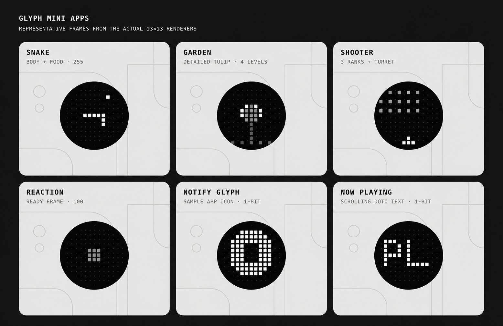

# Glyph Mini Apps

A collection of tiny experiences for the 13×13 Glyph Matrix on the Nothing Phone (4a) Pro. Each mode runs from a Quick Settings tile, so there is no traditional launcher screen.



## Mini apps

| Mode | What it does | How to use it |
| --- | --- | --- |
| **Snake** | Runs a self-playing snake that searches for food and grows. | Tap the **Snake** tile to start. Tap it again to trigger the closing explosion and clear the matrix. |
| **Garden** | Animates a flower swaying in the wind, with drifting clouds and a wilting outro. | Tap the **Garden** tile to start or wilt the flower. Long-press the tile to choose a flower and switch between detailed and solid styles. |
| **Shooter** | Runs a miniature fixed-line shooter with marching invaders. | Tap the **Shooter** tile to start. Use the Essential Key to fire missiles. Tap the tile again to detonate the ship and stop. |
| **Reaction** | Measures how quickly you press the Essential Key after the matrix flashes. | Tap the **Reaction** tile, then press the Essential Key once to arm it. Press again after the flash. Your reaction time scrolls across the matrix; pressing early shows an X. |
| **Notify Glyph** | Flashes the sending app's icon on the matrix when a notification arrives. | Long-press the **Notify Glyph** tile to select apps, then tap the tile to enable or disable notification flashes. |
| **Now Playing** | Scrolls the current song title and artist across the matrix when a new track starts. | Grant notification access, then tap the **Now Playing** tile. Tap it again to stop listening. |

Snake is also available as an Always-on Glyph Toy. The Quick Settings tile and Glyph Toy are independent because Glyph Toys cannot be activated programmatically.

Only one main mode owns the matrix at a time. Starting another mode stops the previous one; notification icons temporarily borrow the display and then return it.

## Requirements

- Nothing Phone (4a) Pro with its 13×13 Glyph Matrix
- Android 14 or newer
- A system build that supports `setAppMatrixFrame` (tested requirement: build `20250801` or newer)
- Android Studio with JDK 17
- Android SDK 35
- Nothing Glyph Matrix SDK 2.0
- ADB for the one-time device setup

## Build and install

1. Download `glyph-matrix-sdk-2.0.aar` from the [Nothing Glyph Matrix Developer Kit](https://github.com/Nothing-Developer-Programme/GlyphMatrix-Developer-Kit) and place it in `app/libs/`.
2. Open the project in Android Studio, or build from the terminal:

   ```bash
   ./gradlew installDebug
   ```

3. Connect the phone over ADB and enable Glyph Matrix debug access:

   ```bash
   adb shell settings put global nt_glyph_interface_debug_enable 1
   ```

4. Optional: allow the app to refresh that debug flag automatically. This is a privileged permission and should only be granted if you have reviewed the source:

   ```bash
   adb shell pm grant com.akil.glyphlife android.permission.WRITE_SECURE_SETTINGS
   ```

The debug flag can expire after roughly 48 hours or a reboot. Without the optional permission, run step 3 again when the matrix stops responding.

## Add the controls

1. Open the phone's Quick Settings editor.
2. Add any of these tiles: **Snake**, **Garden**, **Shooter**, **Reaction**, **Notify Glyph**, and **Now Playing**.
3. Tap a tile to start or stop that mode.

To use Snake as an Always-on Glyph Toy, open **Settings → Glyph Interface → Always-on Glyph Toy**, select **Snake**, and place the phone face-down. If the matrix stays blank after switching toys, toggle Glyph Interface off and on once.

## Enable optional features

### Shooter and Reaction controls

Shooter and Reaction use the phone's Essential Key through an accessibility service that reads key presses only; it does not read screen content.

1. Open **Settings → Accessibility → Glyph Snake** and enable the service.
2. If Essential Space or Essential Recorder still intercepts the key, see [PHONE_CHANGES.md](PHONE_CHANGES.md) for the reversible ADB commands and their trade-offs.

### Notify Glyph and Now Playing

Open **Settings → Notifications → Device & app notifications → Glyph Snake** and grant notification access. Notify Glyph needs it to receive notifications; Now Playing needs it to read active media sessions.

## Project structure

- `app/src/main/java/com/akil/glyphlife/` — game engines, renderers, Android services, tiles, and settings screens
- `app/src/test/java/com/akil/glyphlife/` — small engine and renderer checks
- `PHONE_CHANGES.md` — device changes, reasons, and reversal commands

## Development

Run the project checks with:

```bash
./gradlew testDebugUnitTest
```

This is an independent project and is not affiliated with or endorsed by Nothing Technology Limited.
